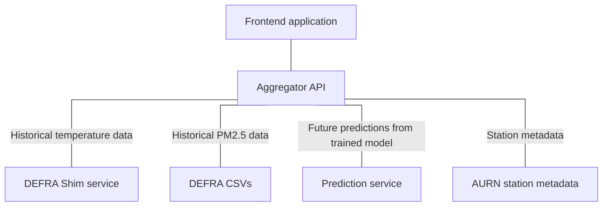

# COMP3000 Project - Frontend

## What is this?

This repository contains a FastAPI service that serves as a thin abstraction over the pyaurn library. This is used in the aggregator to retrieve temperature data and stand-in data for temperature predictions.

## Navigation



- Frontend (https://github.com/Lewis-Trowbridge/COMP3000-Project-Frontend)
- [Aggregator](https://github.com/Lewis-Trowbridge/COMP3000-Project-Backend-API)
- [Predictions](https://github.com/Lewis-Trowbridge/COMP3000-Project-Machine-Learning)
- [Metadata](https://github.com/Lewis-Trowbridge/COMP3000-DEFRA-To-Mongo)
- Shim (you are here)

## How is it made?

This service uses Python and FastAPI to create a REST API over the pyaurn library, which is used to access AURN readings. Data can be queried for a specific timestamp, filtering metrics where necessary.

## How do I use it?

The code can be run simply following the instructions below:

```bash
pip install -r requirements.txt
```

2. Run script

```bash
python main.py
```

From here, an autogenerated Swagger UI page will be available, giving further detail on available endpoints.
